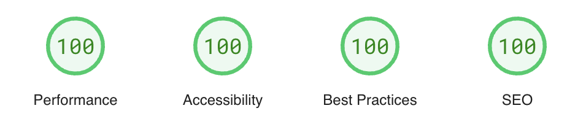

# ☕️ BeanFinder.coffee

BeanFinder is a curated directory of Australian coffee roasters designed to help coffee enthusiasts discover the best roasters across the country. Whether you're looking for a local café or an online multi-roaster subscription, BeanFinder makes it easy to find the perfect cup.

## 🔥 Features

- [x] Responsive Design
- [x] Nested Dynamic routing for pagination
- [x] SEO Optimized
- [x] Theme toggle and memory

## 💻 Tech Stack and tools

- **Main Framework** - [Astro](https://astro.build/)
- **Styling** - [TailwindCSS](https://tailwindcss.com/)
- **Component Library** - [DaisyUI](https://daisyui.com/)
- **Deployment** - [Netlify](https://www.netlify.com/)
- **Code Formatting** - [Prettier](https://prettier.io/)
- **Linting** - [ESLint](https://eslint.org)
- **Package Manager** - [NPM](https://npmjs.com/)

## 🚀 Why the tech?

<details>
  <summary> Click me</summary>

The first iteration of this project was a list of Roasters and their websites on a spreadsheet, but I was finding that I was spending a lot of time on the sheet trying to filter options down to ones that were relevant to what **I wanted**.

This project is as a passion project with the goal of quickly delivering an MVP that could be easily managed and scaled.

Spending too much time online (shoutout [/r/webdev](www.reddit.com/r/webdev) I've seen Astro mentioned a lot and this project seemed like a fun excuse to learn something new.

[Astro's](https://github.com/withastro/astro) main selling points are its speed, lightweight build, and ability to ship less JavaScript to the browser. Astro provided a simple, low-overhead framework that allowed me to focus on building the core features without getting bogged down in setup and configuration. I'd used [Netlify](https://docs.netlify.com/frameworks/astro/) before, and they are the official deployment partner for Astro. Together, they provided a quick, reliable way to get the site live and iterate on it efficiently.

  </details>

## 📝 Challenges and Reflection
<details>
  <summary> Click me</summary>

Once the MVP was created there were two key features I wanted to implement to provide value beyond what the spreadsheet had.Firstly, I wanted to allow easy submissions of new roaster by end users, and secondly I wanted to add pagination for the results. Both of these were more challenging that I expected to implement going into the project. 

The current list of Australian Roasters is around 200 items and is likely to grow. The data is stored in a JSON file since this is a serverless project. The data is imported and then mapped to a card via a JavaScript array.

Initially, filtering results was handled with event listeners on toggles, which would then filter the array. However, some options would still return 60+ items at once, making it less efficient for users to navigate through large datasets.

### Nested Pagination
One of the more significant challenges during development was implementing pagination.

Initially, I considered using array slicing to divide the results across several pages. While this method would have worked, it felt more like a quick fix rather than a sustainable solution. I wanted to build something more robust and maintainable in the long term.

Abstracting the filter options, we have a `state` selector as array of predefined values, and a `cafe` boolean value. Astro supports [Nested Pagination](https://docs.astro.build/en/guides/routing/#nested-pagination) which will solve our issue. Once implemented we can generate static paths dynamically matching these values. This was my first time working with dynamic routing so the learning curve was steep, but thankfully the Astro docs are well detailed.

### Netlify Form Detection
This was one of those features that should have been pretty much build-and-go. Netlify auto-detects any forms in your site and handles submission through their back-end services. However, this wasn’t happening (and from their support forums, I'm not the only one facing this issue when using Astro). I ended up using a combination of a __form.html file in the /public folder to help Netlify's form detection bots, and then AJAX for data submission. There was a lot of trial and error involved, but it was nice to handle this internally without adding another third-party tool to the project.

### Handling Race Conditions with React Hooks
One of the unexpected challenges I faced during development was managing the Google Maps integration using React components and hooks. Initially, I designed the map functionality to be highly modular, with each aspect (such as geolocation, markers, and search) handled by separate hooks. This seemed like the right approach to keep the code clean and maintainable. However, I soon encountered a persistent race condition due to Astro’s partial hydration process. Different hooks were being initialized at different times, leading to inconsistent state and unreliable map behavior.

After several attempts to synchronize the hooks, I realized that the complexity of managing these asynchronous operations across multiple components was causing more issues than it was solving. The solution was to refactor the code into more of a monolithic component that handles all the map logic internally. This approach, while less modular, eliminated the race condition and provided a more reliable user experience. Although it was a shift from the initial plan, it reinforced the importance of flexibility in project development, especially when working with frameworks that introduce unique challenges like Astro’s partial hydration.

### Reflection
Astro's approach to SSG was a fantastic match for this project, and I found learning the framework straightforward - allowing me to focus on what I wanted. Dynamic routing took a *long* time to get functional, and working but was the most rewarding part of the project once it was complete. Netlify (minus the form detection) made a quick and easy CD cycle for the project. All in all I'm happy with how this project came together and I'm excited to start spending my time trying new roasters instead of building this website. 

  </details>


## ⚡️ Lighthouse Scores

<p align="center">
  <a href="https://pagespeed.web.dev/analysis/https-beanfinder-coffee/xdkourytlh?form_factor=desktop">
    </a> 
</p>

## 👾 Project Structure

```bash
/
├── public/
│   │
│   └── favicon.svg
│   └── __forms.html # for Netlify detection
│
├── src/
│   ├── components/
│   ├── hooks/
│   ├── data/
│   ├── layouts/
│   └── pages/
│   │     └── roasters
│   │     │    └── [state]
│   │     │       └── [cafe]
│   │     │              └── [page]
│   │     └── online-subscriptions
│   │            └── [page]
│   ├── scripts/
│   └── utils/
└── package.json et al
```

## 🔎 Add a roaster?

If I've missed a roaster in the site, let me know [via email](mailto:hello@xandersalathe.com), [by the form on the website](https://beanfinder.coffee/submit/), or by [opening an issue](https://github.com/xdaybreakerx/beanfinder.coffee/issues) on this repo.

## 🖥️ Data Source

[This Google Sheet](https://docs.google.com/spreadsheets/d/e/2PACX-1vQMtPdz_le8HBLjTgAMK80IEoeZpZZGlZjcAdXh7Xd9Ld0Zy7zRV9duKyB7u_zHifi8nB9LiZogjXtb/pubhtml) (also by me)

## 📜 License

This project is licensed under the [MIT license.](https://github.com/xdaybreakerx/beanfinder.coffee/blob/main/LICENSE)

## 🏃‍➡️ Run App Locally

### Getting Started

1. Clone this repo
2. Install the dependencies: `npm install`
3. Start a local dev server: `npm run dev`

### Commands

All commands are run from the root of the project, from a terminal:

| Command                | Action                                           |
| :--------------------- | :----------------------------------------------- |
| `npm install`          | Installs dependencies                            |
| `npm run dev`          | Starts local dev server at `localhost:4321`      |
| `npm run build`        | Build your production site to `./dist/`          |
| `npm run preview`      | Preview your build locally, before deploying     |
| `npm run astro ...`    | Run CLI commands like `astro add`, `astro check` |
| `npm run astro --help` | Get help using the Astro CLI                     |

## ✅ My To-Do List

<details>
  <summary> Click me</summary>
  
## MVP: 
- [x] show coffee roasters from JSON file

## To-do:

- [x] client side filtering of JSON
- [x] theme toggle
- [x] netlify deploy
- [x] confirm and update all cafe info entries as required in JSON (︶︹︶)

## Stretch to-do

- [x] theme selection persists between visits
- [x] footer for contact information to update list (ended up going a different direction on this - created a form element for user submission of issues/recommendations)
- [x] drawer for filter options
- [x] pagination for results array
- [x] custom 404 page
- [x] Google Maps integration
- [ ] Sort by rating or alphabetical in list view

</details>
