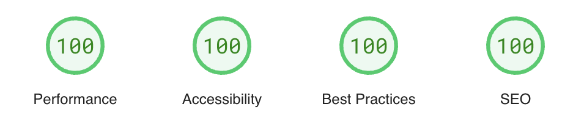

# ☕️ BeanFinder.coffee

BeanFinder is a curated directory of Australian coffee roasters designed to help coffee enthusiasts discover the best roasters across the country. Whether you're looking for a local café or an online multi-roaster subscription, BeanFinder makes it easy to find the perfect cup.

## 🔥 Features

- [x] Responsive Design
- [x] Nested Dynamic routing for pagination
- [x] SEO Optimized
- [x] Theme toggle and memory
- [x] Searchable A–Z directory with state, cafe, and multi-roaster filters
- [x] Australian-only map locations

The directory filters are saved in the URL so searches can be bookmarked or shared. Cafe listings show locality links to saved Australian Google Maps locations; their addresses can also be searched in the directory. Listings without a saved location have a labelled map search fallback. Multi-roaster sellers are presented as online services for Australia, with the state filter hidden when browsing sellers alone.

The daisyUI `caramellatte` (light) and `coffee` (dark) themes follow the system preference until a visitor chooses a theme. Existing saved light/dark choices are retained. Both themes include visible keyboard focus and a skip link.

The weekly Places enrichment checks Australian formatted addresses when choosing candidates, then requires Google's `AU` country component and valid coordinates before saving details. The map also filters cached data: older records without a country code must end their formatted address with `Australia`. A location that fails verification is omitted from the map; its roaster remains in the directory. API failures stop enrichment before replacing the corresponding data file.

## 💻 Tech Stack and tools

- **Main Framework** - [Astro](https://astro.build/)
- **Styling** - [TailwindCSS](https://tailwindcss.com/)
- **Component Library** - [DaisyUI](https://daisyui.com/)
- **Deployment** - [Netlify](https://www.netlify.com/)
- **Code Formatting** - [Prettier](https://prettier.io/)
- **Linting** - [ESLint](https://eslint.org)
- **Package Manager** - [NPM](https://npmjs.com/)

## 🚀 Why the tech?

<details>
  <summary> Click me</summary>

The first iteration of this project was a list of Roasters and their websites on a spreadsheet, but I was finding that I was spending a lot of time on the sheet trying to filter options down to ones that were relevant to what **I wanted**.

This project is as a passion project with the goal of quickly delivering an MVP that could be easily managed and scaled.

Spending too much time online (shoutout [/r/webdev](www.reddit.com/r/webdev) I've seen Astro mentioned a lot and this project seemed like a fun excuse to learn something new.

[Astro's](https://github.com/withastro/astro) main selling points are its speed, lightweight build, and ability to ship less JavaScript to the browser. Astro provided a simple, low-overhead framework that allowed me to focus on building the core features without getting bogged down in setup and configuration. I'd used [Netlify](https://docs.netlify.com/frameworks/astro/) before, and they are the official deployment partner for Astro. Together, they provided a quick, reliable way to get the site live and iterate on it efficiently.

  </details>

## 📝 Challenges and Reflection
<details>
  <summary> Click me</summary>

Once the MVP was created there were two key features I wanted to implement to provide value beyond what the spreadsheet had.Firstly, I wanted to allow easy submissions of new roaster by end users, and secondly I wanted to add pagination for the results. Both of these were more challenging that I expected to implement going into the project. 

The current list of Australian Roasters is around 200 items and is likely to grow. The data is stored in a JSON file since this is a serverless project. The data is imported and then mapped to a card via a JavaScript array.

Initially, filtering results was handled with event listeners on toggles, which would then filter the array. However, some options would still return 60+ items at once, making it less efficient for users to navigate through large datasets.

### Nested Pagination
One of the more significant challenges during development was implementing pagination.

Initially, I considered using array slicing to divide the results across several pages. While this method would have worked, it felt more like a quick fix rather than a sustainable solution. I wanted to build something more robust and maintainable in the long term.

Abstracting the filter options, we have a `state` selector as array of predefined values, and a `cafe` boolean value. Astro supports [Nested Pagination](https://docs.astro.build/en/guides/routing/#nested-pagination) which will solve our issue. Once implemented we can generate static paths dynamically matching these values. This was my first time working with dynamic routing so the learning curve was steep, but thankfully the Astro docs are well detailed.

### Netlify Form Detection
This was one of those features that should have been pretty much build-and-go. Netlify auto-detects any forms in your site and handles submission through their back-end services. However, this wasn’t happening (and from their support forums, I'm not the only one facing this issue when using Astro). I ended up using a combination of a __form.html file in the /public folder to help Netlify's form detection bots, and then AJAX for data submission. There was a lot of trial and error involved, but it was nice to handle this internally without adding another third-party tool to the project.

### Handling Race Conditions with React Hooks
One of the unexpected challenges I faced during development was managing the Google Maps integration using React components and hooks. Initially, I designed the map functionality to be highly modular, with each aspect (such as geolocation, markers, and search) handled by separate hooks. This seemed like the right approach to keep the code clean and maintainable. However, I soon encountered a persistent race condition due to Astro’s partial hydration process. Different hooks were being initialized at different times, leading to inconsistent state and unreliable map behavior.

After several attempts to synchronize the hooks, I realized that the complexity of managing these asynchronous operations across multiple components was causing more issues than it was solving. The solution was to refactor the code into more of a monolithic component that handles all the map logic internally. This approach, while less modular, eliminated the race condition and provided a more reliable user experience. Although it was a shift from the initial plan, it reinforced the importance of flexibility in project development, especially when working with frameworks that introduce unique challenges like Astro’s partial hydration.

### Reflection
Astro's approach to SSG was a fantastic match for this project, and I found learning the framework straightforward - allowing me to focus on what I wanted. Dynamic routing took a *long* time to get functional, and working but was the most rewarding part of the project once it was complete. Netlify (minus the form detection) made a quick and easy CD cycle for the project. All in all I'm happy with how this project came together and I'm excited to start spending my time trying new roasters instead of building this website. 

  </details>


## ⚡️ Lighthouse Scores

<p align="center">
  <a href="https://pagespeed.web.dev/analysis/https-beanfinder-coffee/xdkourytlh?form_factor=desktop">
    </a> 
</p>

## 👾 Project Structure

```bash
/
├── public/
│   │
│   └── favicon.svg
│   └── __forms.html # for Netlify detection
│
├── src/
│   ├── components/
│   ├── hooks/
│   ├── data/
│   ├── layouts/
│   └── pages/
│   │     └── roasters
│   │     │    └── [state]
│   │     │       └── [cafe]
│   │     │              └── [page]
│   │     └── online-subscriptions
│   │            └── [page]
│   ├── scripts/
│   └── utils/
└── package.json et al
```

## 🔎 Add a roaster?

If I've missed a roaster in the site, let me know [via email](mailto:hello@xandersalathe.com), [by the form on the website](https://beanfinder.coffee/submit/), or by [opening an issue](https://github.com/xdaybreakerx/beanfinder.coffee/issues) on this repo.

## 🖥️ Data Source

[This Google Sheet](https://docs.google.com/spreadsheets/d/e/2PACX-1vQMtPdz_le8HBLjTgAMK80IEoeZpZZGlZjcAdXh7Xd9Ld0Zy7zRV9duKyB7u_zHifi8nB9LiZogjXtb/pubhtml) (also by me)

## Form submission pull requests

After a production form submission is verified, Netlify invokes `app/netlify/functions/submission-created.mts`. The function validates the directory fields, reads the latest `main` data through GitHub's API, and creates a `forms/<submission-id>` branch and review PR. It never writes to `main` or merges PRs. The Netlify platform [verifies event signatures](https://docs.netlify.com/build/functions/trigger-on-events/#signature) before invocation; no webhook notification needs to be configured.

Recommendations require a name, HTTP(S) website, state, cafe status, and multi-roaster status. Corrections identify the existing listing by website/name; the optional original website supports renamed listings and changed URLs. Blank state/status fields preserve existing values. Corrections with only explanatory notes open a PR containing a review receipt, so a maintainer can make the corresponding edit. Unmatched or ambiguous corrections are rejected and logged for manual follow-up. Recommendations already in the directory are skipped.

Each PR commits directory changes, the release version files when data changes, and a whitelisted receipt under `.github/form-submissions/`. Names, websites, and notes become public, as explained on the form; contact details, IP addresses, and other raw submission metadata are excluded. Duplicate deliveries reuse an existing open or closed PR. A retry after a branch was created resumes PR creation without overwriting the branch. Distinct submissions can propose overlapping edits; review conflicts and duplicate proposals before merging. Individual roasters enter the map through the existing weekly enrichment workflow after merge.

### Release versioning

App releases choose the major/minor numbers manually; form data updates increment only the final patch number. For example, after a manual app release sets `1.1.0`, subsequent data PRs propose `1.1.1`, `1.1.2`, and so on. A patch increment from `1.1.9` produces `1.1.10`, without changing the app's major/minor numbers. GitHub tags use the canonical `v1.1.0`/`v1.1.1` form.

A data-changing PR reads `app/package.json` and `app/package-lock.json` from the same latest-main commit as the directory data, then updates the package version, lockfile version, and lockfile root package version atomically with its data changes. The PR description and receipt record the proposed version. Retries reuse that version rather than incrementing again. Duplicate recommendations and explanation-only corrections do not bump the version. If a maintainer adds a directory edit to an explanation-only correction, include the appropriate patch bump before merging.

If main's version advances while a PR is open, update that PR's package and lockfile versions to the next patch after main before merging. Two pending PRs can initially propose the same patch; the automation leaves reviewed branches untouched. Release publication remains manual: the function never creates tags or publishes GitHub releases, and merging a version bump follows the existing Netlify main-branch deployment behavior.

For a larger app release, use `npm version minor --no-git-tag-version --ignore-scripts` from `app/` (or select another stable version explicitly), commit both version files, and publish the matching GitHub release after review. Keep package and lockfile root versions aligned; mismatched files and prerelease versions stop automated data PR creation instead of guessing the next version.

### Activation

1. Create a GitHub fine-grained personal access token restricted to `xdaybreakerx/beanfinder.coffee`, with **Contents: read/write** and **Pull requests: read/write** permissions. Metadata read access is automatic. Set an appropriate expiry and rotate the token before it expires.
2. In the Netlify project's environment variables, add `FORM_PR_GITHUB_TOKEN` for the **production** deploy context, including the **Functions** scope (or all scopes on plans without scope selection). Keep the token out of Git and local payload files. The repository name and target branch are fixed in the implementation.
3. Merge and deploy this branch, or trigger a new production deploy after changing the variable. Netlify snapshots function environment variables at deployment time; [`netlify.toml` variables are not available at function runtime](https://docs.netlify.com/build/functions/environment-variables/).
4. Submit a real recommendation and confirm its PR and CI/Netlify checks. Preview events are ignored. PRs created with this token trigger normal review checks rather than using the Actions `GITHUB_TOKEN`.

The legacy event filename intentionally retains the submission ID, which the newer typed form event omits, so the automation can deduplicate deliveries. The static form in `app/public/__forms.html` must mirror the visible field names; browser tests check this.

### Recovery and local testing

GitHub/network failures fail the function visibly in Netlify logs; malformed submissions log a rejection without their raw data. Netlify retains the submission independently of PR creation. Do not assume failed events are automatically retried. A maintainer can retry using a local JSON file containing the event's `payload` object (or `{ "payload": ... }`). Only retry submissions confirmed as verified in Netlify. For example:

```json
{
  "id": "netlify-submission-id",
  "form_name": "roaster-form",
  "data": {
    "submission-type": "recommendation",
    "roaster-name": "Example Coffee",
    "roaster-website": "https://example.coffee/",
    "state": "VIC",
    "has-cafe": "true",
    "multi-roaster": "false",
    "details": "Suggested directory addition"
  }
}
```

From `app/`, run `node src/scripts/replay-form-submission.mjs /path/to/payload.json --dry-run` to validate against local directory data without API calls. To create or resume the real PR, securely set `FORM_PR_GITHUB_TOKEN` in your shell and run the same command without `--dry-run`. Do not paste tokens into command history. This event function handles new events; installing it does not replay the existing backlog.

For older verified submissions, use the maintainer batch command from a clean branch based on current main:

```sh
node src/scripts/backfill-form-submissions.mjs /private/path/verified-submissions.json src/data/form-backfill-reviews-2026-10-05.json
node src/scripts/backfill-form-submissions.mjs /private/path/verified-submissions.json src/data/form-backfill-reviews-2026-10-05.json --write
```

The input is an array of verified payloads exported from Netlify's form submissions API, ordered oldest first. Keep the export outside the repository. The review file maps submission IDs to `fields` overrides, optional official website `sources`, or `{ "action": "skip", "reason": "..." }`. Fields use the form's names and string values, including `"true"`/`"false"` for cafe and multi-roaster status. Legacy checkbox selections are converted into the new submission type; ambiguous selections and missing classifications remain `needs-review`. Supply reviewed `details` for corrections; historical free text and private metadata are excluded automatically.

The command defaults to a dry run. `--write` prepares only local directory, receipt, and version files; review the diff and open a PR before merging. All data changes share one patch bump. Recommendations already listed and repeated backlog recommendations are skipped; existing receipts make subsequent runs idempotent. Review conflicts with other pending data PRs before merging.

## 📜 License

This project is licensed under the [MIT license.](https://github.com/xdaybreakerx/beanfinder.coffee/blob/main/LICENSE)

## 🏃‍➡️ Run App Locally

### Getting Started

1. Clone this repo
2. Use Node.js 26.10.0 (the pinned Current release): `nvm install && nvm use`
3. Change to the app directory: `cd app`
4. Install the locked dependencies: `npm ci`
5. Start a local dev server: `npm run dev`

The Node version is pinned in `.nvmrc` and Netlify's build configuration, and the GitHub workflows use that same pin. [Netlify Functions currently fall back to Node 24](https://docs.netlify.com/build/functions/configuration/#nodejs-version-for-runtime) when the build uses Node 26; the application uses APIs supported by both versions.

The application checks use TypeScript 7's native compiler. Netlify's dependency analyzer still requires the classic compiler API, so the project also installs Microsoft's TypeScript 6 compatibility package using their [recommended npm aliases](https://devblogs.microsoft.com/typescript/announcing-typescript-7-0/#running-side-by-side-with-typescript-6.0).

### Commands

All commands are run from the `app/` directory, from a terminal:

| Command                | Action                                           |
| :--------------------- | :----------------------------------------------- |
| `npm install`          | Installs dependencies                            |
| `npm run dev`          | Starts local dev server at `localhost:4321`      |
| `npm run build`        | Build your production site to `./dist/`          |
| `npm test`             | Run map, country validation, and form automation tests |
| `npm run check`        | Check TypeScript after generating Astro types    |
| `npm run test:e2e`     | Run desktop/mobile flows and automated accessibility checks |
| `npm run preview`      | Preview your build locally, before deploying     |
| `npm run astro ...`    | Run CLI commands like `astro add`, `astro check` |
| `npm run astro --help` | Get help using the Astro CLI                     |

Before the first browser test run, install Chromium with `npx playwright install chromium`.

Browser tests scan the homepage, directory, state listings, multi-roaster listings, submission form, success page, and 404 page in both themes with axe-core. These automated checks complement keyboard and responsive-layout tests; the live third-party Google Maps interface still needs manual review in the deploy preview.

For a different development port, set `DEV_SITE_URL` to that server's origin so pagination links use the same server. The browser tests set this for their dedicated port automatically.

## ✅ My To-Do List

<details>
  <summary> Click me</summary>
  
## MVP: 
- [x] show coffee roasters from JSON file

## To-do:

- [x] client side filtering of JSON
- [x] theme toggle
- [x] netlify deploy
- [x] confirm and update all cafe info entries as required in JSON (︶︹︶)

## Stretch to-do

- [x] theme selection persists between visits
- [x] footer for contact information to update list (ended up going a different direction on this - created a form element for user submission of issues/recommendations)
- [x] drawer for filter options
- [x] pagination for results array
- [x] custom 404 page
- [x] Google Maps integration
- [ ] Sort by rating or alphabetical in list view

</details>
