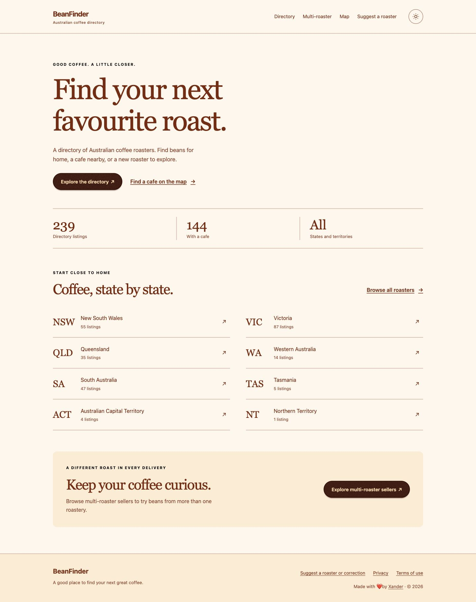

# BeanFinder.coffee

A curated Australian coffee directory for finding beans, nearby cafes and multi-roaster sellers. Built and maintained by [Xander](https://github.com/xdaybreakerx).

**[Visit BeanFinder](https://beanfinder.coffee)** · [Suggest a roaster or correction](https://beanfinder.coffee/submit/) · [Contributing](CONTRIBUTING.md)



## Features

- Search 231 roasters by name, website or location; filter by state/cafe and sort by name or saved rating. Filters and pagination are shareable URLs.
- Compare eight multi-roaster sellers by subscription, selection and brew options.
- Browse Australian cafe/roaster locations on Google Maps, with location search, optional geolocation and place-specific directions.
- Light/dark themes, keyboard navigation, responsive layouts, privacy/terms pages and social-sharing previews.
- Recommendations and corrections become reviewed GitHub PRs with data validation and patch versioning.

The directory contains 239 businesses as of 6 October 2026. Saved Google ratings have unknown retrieval dates and can be out of date; current marker addresses are fetched only when selected. Cafe access and opening hours should be checked with the operator.

## Stack

Astro 7, React 19, TypeScript, Tailwind CSS 4 and daisyUI 5; deployed on Netlify with Google Maps and temporary coordinates in Netlify Blobs. Tests use Vitest, Playwright and axe-core. Curated business data stays in Git-reviewed JSON.

## Run locally

Use the Node version pinned in `.nvmrc` (26.10.0):

```sh
nvm install
nvm use
cd app
npm ci
npm run dev
```

The server starts at <http://localhost:4321>. Google Maps needs a browser API key; see [environment setup and checks](CONTRIBUTING.md). Directory browsing works without a key.

## Verification and documentation

Accessibility and performance verification was signed off on 6 October 2026, including desktop Safari and the maintainer's iPhone/VoiceOver review. Production Lighthouse lab performance was 100 for the homepage/directory on mobile and 91 for the map; all measured accessibility, best-practices and SEO scores were 100. These are individual lab runs, not field performance guarantees.

- [Release verification and measured results](docs/release-verification.md)
- [v2.0.0 release notes](docs/releases/v2.0.0.md)
- [Contributing, data review and test commands](CONTRIBUTING.md)
- [Maintainer operations and recovery](docs/operations.md)
- [Current screenshots](docs/screenshots/README.md)

## License

[MIT](LICENSE).
